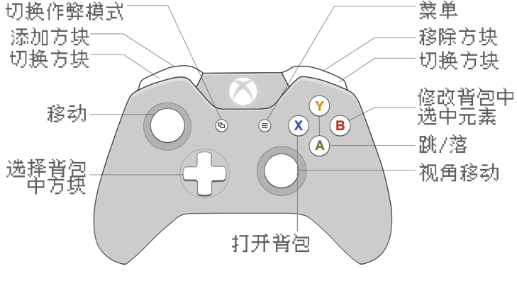
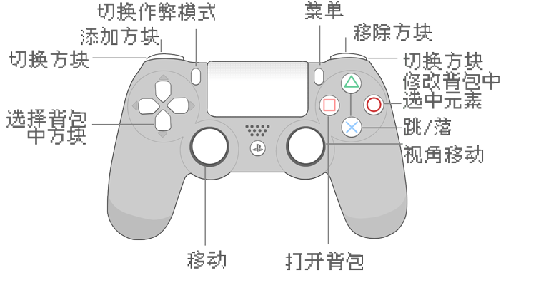

<div align="center">
  

  <h2>ThreeCraft</h2>

  <p>
    <strong>⛏ 基于Three.js的MineCraft网页版实现</strong>
  </p>

  <p>
    
    
    
    

  </p>

  <h4>
    <a href="https://mc.liukairui.me">在线体验</a>
    <span> | </span>
    <a href="https://github.com/KairuiLiu/ThreeCraft/blob/master/README.md">English</a>
    <span> | </span>
    <a href="https://github.com/KairuiLiu/ThreeCraft/blob/master/README-CN.md">简体中文</a>
  </h4>
</div>

### ✨ 特性

- 支持多人联机游戏
- 高效的碰撞检测方法
- 高效的多线程动态无限地图生成与局部刷新方法
- 五种游戏场景随机出现(经典 / 冰雪 / 月下沙滩瓜田 / 万圣节 / 奇异)
- 多端多操控模式支持(PC 端, 移动端, VR 端, PS4/5 手柄支持, Xbox 手柄支持)
- 多种参数可调(视角 / 雾气 / 场景大小 / 操纵范围 / 音量 / 线程数 / 操作灵敏度 / 语言 / 操作模式 / 十字准星颜色 / 背包模式 / 作弊模式)
- 多种存档与读档方式
- 双语言支持(中文 / 英文)
- 原版音效
- PWA 支持

### 🎮️ 操作方法

- **PC 端**

  - **空格键**: 跳跃
  - **E 键**: 开关背包
  - **Q 键**: 切换作弊模式
  - **鼠标移动**: 变换朝向
  - **WSAD 键**: 前后左右移动
  - **数字键**: 切换手持方块
  - **滚轮滚动**: 切换手持方块
  - **点击物品框**: 切换手持方块
  - **Shift 键**: 作弊模式时下降
  - **鼠标左/右击**: 摧毁/创建方块
  - **ESC 键**: 取消鼠标锁定/显示菜单

- **移动端**

  - **拖动屏幕**: 变换朝向
  - **点击物品框**: 切换手持方块
  - **点击激活的物品框**: 打开背包

- **Xbox 手柄(使用 Xbox one 测试)**

  

- **PS 手柄(使用 PS4 测试)**

  

- **VR 端**

  - **转动头显**: 变换朝向
  - **使用遥控器**: 摧毁方块

### 🛠️ 安装

- 前端

  ```bash
  # 安装pnpm
  > npm install -g pnpm

  # 安装全部依赖
  > pnpm install

  # 安装某个依赖
  > pnpm install xxx  -D/-S

  # 运行
  > pnpm dev

  # 打包
  > pnpm build
  ```

- 后端

  ```bash
  # 进入后端目录
  > cd server

  # 安装全部依赖
  > pnpm install

  # 编译TS代码
  > tsc

  # 执行后端程序(如果不需要PM2等进程管理工具)
  > node ./dist/index.js

  # 安装PM2
  > pnpm install -g pm2

  # 注册PM2监视
  > pm2 start --watch ./dist/index.js

  # 如需反向代理, 请将 /socket.io 代理到 localhost:9000 并配置同源策略
  ```

  程序运行后会输出如下提示

  ```
  ThreeCraft v1.0.0 game server running at:
  > Local:        http://localhost:9000
  > Network:      http://xxx.xxx.xxx.xxx:9000

  YOU MUST ENTER THE ADDRESS LIKE http://xxx.xxx.xxx.xxx:9000 IN GAME, NO PART CAN BE OMITTED!
  ```

  在游戏中连接服务器时候请务必输全`http://192.168.0.2:9000`, 不要省略`http://`或`:9000`

  如果前端运行在https上, 那么后端也应该运行在https上. 可能需要一些反向代理工具实现https

### 📃 文档

- [开题报告.pdf](./doc/opening-report/build/slides-export.pdf)
- [总体设计.md](./doc/overall-design)
- [结课报告.md](./doc/final-report)

### 🥰 参考

- 项目整体结构参考了 [vyse12138/minecraft-threejs](https://github.com/vyse12138/minecraft-threejs), 这个项目很棒. 非常感谢这个项目!
- 移动端游戏手柄的实现参考了[bobboteck/JoyStick](https://github.com/bobboteck/JoyStick)
- 项目的后端整体结构参考了 [Merlin218/UNO-server](https://github.com/Merlin218/UNO-server/). 非常感谢这个项目!
