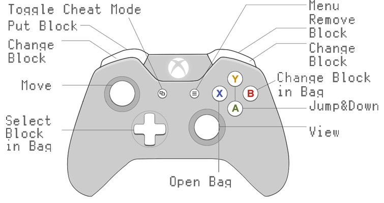
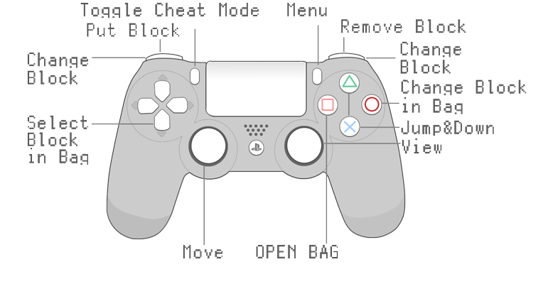

<div align="center">
  

  <h2>ThreeCraft</h2>

  <p>
    <strong>⛏ MineCraft Release Based on Three.js</strong>
  </p>

  <p>
    
    
    
    

  </p>

  <h4>
    <a href="https://mc.liukairui.me/en">Live Demo</a>
    <span> | </span>
    <a href="https://github.com/KairuiLiu/ThreeCraft/blob/master/README.md">English</a>
    <span> | </span>
    <a href="https://github.com/KairuiLiu/ThreeCraft/blob/master/README-CN.md">简体中文</a>
  </h4>
</div>

### ✨ Feature

- [ ] Multiplayer online games
- [x] Efficient collision detection method
- [x] Efficient multi-threaded dynamic infinite map generation and partial refresh method
- [x] Five random game scenes (Classic / Ice / Beach Melon Field / Halloween / Bizarre)
- [x] Multi-terminal and multi-control mode support (PC, mobile, VR, PS4/5 Joy Stick, Xbox Joy Stick support)
- [x] Multiple parameters can be adjusted(FOV / Fog factor / Simulate range / Operation range / Volume / Number of threads / Operation sensitivity / Language / Operation mode / Crosshair color / Backpack mode / Cheat mode)
- [x] Multiple ways to save and load archive
- [x] Dual language support (Chinese / English)
- [x] Original sound

### 🎮️ Operation

- **PC**

  - **Space Bar**:Jump
  - **E Key**: Switch Bag
  - **Q Key**: Cheat Mode
  - **Mouse Move**: Change Orientation
  - **WSAD Key**: Move
  - **Number Key**: Toggle Block
  - **Wheel Scroll**: Toggle Block
  - **Click Item Box**: Toggle Block
  - **Shift Key**: Drop in Cheat Mode
  - **Mouse left/right click**: Destroy/Create Blocks
  - **ESC Key**: Show Menu

- **Mobile**

  - **Drag Screen**: Change Orientation
  - **Click Item Box**: Toggle Block
  - **Click Active Item**: Open Backpack

- **Xbox Joy Sitck(test on Xbox one)**

  

- **PS Joy Sitck(test on PS4)**

  

- **VR**
  - **Turn Headset**: Change Orientation
  - **Using Remote**: Destroy Blocks

### 🛠️ Install

- Frontend

  ```bash
  # Install pnpm
  > npm install -g pnpm

  # Install all dependance
  > pnpm install

  # Install a dependance
  > pnpm install xxx  -D/-S

  # Run
  > pnpm dev

  # Build
  > pnpm build
  ```

- Backend

  ```bash
  # emm
  ```

### 🥰 Reference

- The overall structure of the project refers from [vyse12138/minecraft-threejs](https://github.com/vyse12138/minecraft-threejs). Thanks a lot for their work!
- The implementation of the mobile joystick refers from [bobboteck/JoyStick](https://github.com/bobboteck/JoyStick)
- The overall structure of backend refers from [Merlin218/UNO-server](https://github.com/Merlin218/UNO-server/). Thanks a lot for his work!
