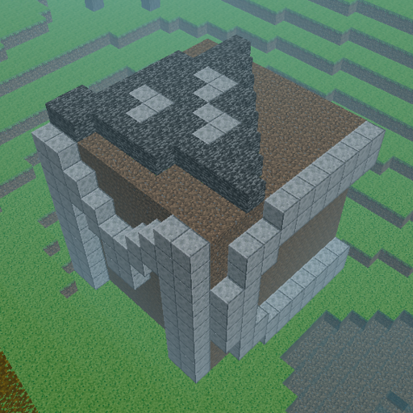

<h2 align="center">

 ThreeCraft
</h2>

<strong>⛏🧱基于Three.js的MineCraft网页版实现</strong>

### ✨特性与预览

- demo: ~~[mc.liukairui.me](mc.liukairui.me)~~

### 🎮️操作方法

- 还没想好

### 🛠️部署

- 还没想好

### 📃文档

- 还没想好

