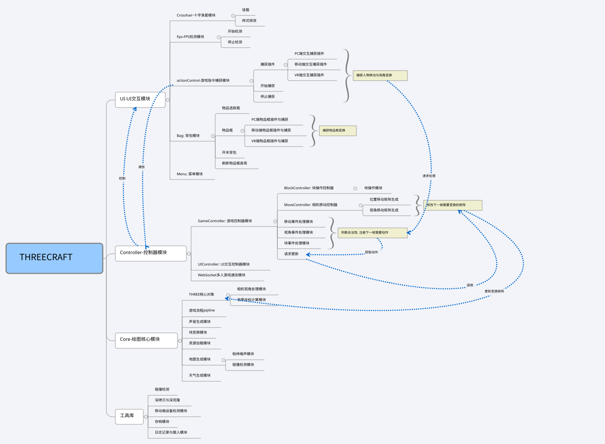

## 基本信息

### 内容提要


《我的世界》是微软旗下的沙盒游戏. 游戏中, 玩家可以在一个3D世界内与方块进行交互. 游戏中的特色功能包括探索世界, 采集资源, 合成物品及生存冒险等.截至2021年5月，《我的世界》拥有2.38亿销量，1.5亿月活跃用户，成为有史以来最畅销的电子游戏. 其具有如下特点

- 丰富模式 - 生存模式 / 创造模式 / 冒险模式 / 极限模式 / 旁观模式
- 方便联机 - 局域网联机 / 互联网联机(官方/自建服务器)
- 高可扩展 - 提供开放接口, 模组 / 贴图 / 地图等均可从自定义
- 跨平台 - Windows / Linux / OSX / iOS / Xbox / 安卓 / PS / Switch / VR
- 社区活跃 - 玩家基数多
- 高自由度 - 无限地图
- 紧跟前沿技术 - 支持光线追踪 / DLSS...

近年来, 随着浏览器与前端技术的蓬勃发展, 95%以上的浏览器已经支持Canvas, WebGL等绘图API, 基于HTML5的游戏与应用层出不穷. 本项目为基于 Three.js 开发的网页版我的世界, 实现了我的世界中的一些基本功能. 旨在对前端 3D 动画及可视化领域进行一些探索


### abstract

MineCraft is a sandbox game from Microsoft. In the game, players can interact with cubes in a 3D world. Features in the game include exploring the world, gathering resources, synthesizing items and surviving adventures. As of May 2021, MineCraft has sold 238 million units and has 150 million monthly active users, making it the best-selling video game of all time. It has the following features

- Abundant modes - Survival / Creation / Adventure / Extreme / Spectator
- Easy online access - LAN access / Internet access (official / self-built servers)
- Highly scalable - open interface, customizable modules / mapping / maps, etc.
- Cross-platform - Windows / Linux / OSX / iOS / Xbox / Android / PS / Switch / VR
- Active community - large player base
- High freedom - unlimited maps
- Keeping up with cutting-edge technology - Support for ray tracing / DLSS...

In recent years, with the booming of browser and front-end technology, more than 95% of browsers already support Canvas, WebGL and other drawing APIs, and there are many HTML5-based games and applications. This project is a web-based version of MineCraft developed by Three.js, which implements some basic functions of MineCraft. It aims to explore the front-end 3D animation and visualization field.

Translated with www.DeepL.com/Translator (free version)

### 关键词

MineCraft; WebGL; ThreeJS; WebWorker; PWA;

### 参考书目

[1] Kouichi Matsuda,Rodger Lea.WebGL编程指南[M].电子工业出版社. 2014.6
[2] Jos Dirksen.Three.js开发指南: 基于WebGL和HTML5在网页上渲染3D图形和动画(原书第3版)[M].机械工业出版社. 2019.7
[3] GAMES101:现代计算机图形学入门, https://games-cn.org/intro-graphics/, 2020年2月11日
[4] minecraft-threejs, https://github.com/vyse12138/minecraft-threejs, 2022年6月12日
[5] JoyStick, https://github.com/bobboteck/JoyStick, 2021年12月22日
[6] UNO-server, https://github.com/Merlin218/UNO-server/, 2022年5月16日
[7] Understanding Perlin Noise, http://adrianb.io/2014/08/09/perlinnoise.html, 2014年2月


## 概述

### 问题描述

本次学年设计致力于使用Three.js实现我的世界游戏中的基本功能, 包括

- 实现基本的游戏菜单
- 实现多种游戏交互方式(PC 端, 移动端, VR 端, PS4/5 手柄支持, Xbox 手柄支持)
- 实现人物运动
- 实现销毁与添加块
- 实现背包栏与背包

### 目标

- 实现基于 WebSocket / WebRTC 的多人联机游戏
- 实现高效的碰撞检测方法
- 实现高效的多线程动态无限地图生成与局部刷新方法
- 实现块补全算法
- 实现多种游戏场景
- 实现多端多操控模式支持(PC 端, 移动端, VR 端, PS4/5 手柄支持, Xbox 手柄支持)
- 实现多种参数可调(视角 / 雾气 / 场景大小 / 操纵范围 / 音量 / 线程数 / 操作灵敏度 / 语言 / 操作模式 / 十字准星颜色 / 背包模式 / 作弊模式)
- 实现多种存档与读档方式
- 实现双语言支持(中文 / 英文)
- 实现原版音效
- 实现PWA支持

### 任务

将本次学年设计任务拆解如下

- UI
  - 基本UI组件实现
  - 菜单实现与挂载
  - 交互事件捕获
  - 上载 / 下载存档
  - 全屏与鼠标锁定API
  - 参数调节实现
  - 背包UI实现
  - FPS显示
  - 十字准星实现
- 绘图核心
  - 环境生成
  - 水/云生成
  - 音效支持
- 控制部分
  - 地形生成算法实现
  - 碰撞检测算法实现
  - 世界模型变换实现
  - 高效日志实现
  - 游戏手柄支持
  - 多人游戏支持

## 基本概念和方法、工具

### 软件开发基本概念

由于Three.js对面向对象支持非常好, 我们也选用了TS作为开发语言, 本项目采用面向对象方法开发, 项目结构如下



### 关键技术

在典型HTML游戏开发时, 我们通常会使用Unity / unreal等游戏引擎, 或者使用COCOS等游戏框架 , 或者使用Vue / React等MVVM框架, 但是本次学年设计的目的是进行基本的 Web 3D 实践, 并不需要复杂的游戏流程控制等逻辑, 所以仅采用以下技术实现

- Three.JS:

  WebGL是OpenGL ES的浏览器实现, Three.js 是对 WebGL 的二次封装, 其关系如下:

  ```mermaid
  graph LR
  openGL(openGL) --> openGLES(openGL ES) --> webGL(webGL) --> Three(Three.JS)
  ```

- TypeScript: Three.JS 是对WebGL的面向对象封装, 其具有良好的TS支持, 本次实验也将使用TS作为编程语言
- Vite: 使用Vite作为项目编译打包工具, 其具有如下特点
  - 极速的服务启动: 与常见的WebPack打包工具不同, Vite使用声明式打包, HMR速度速度极快
  - 可优化构建: 可选 “多页应用” 或 “库” 模式的预配置 Rollup 构建
  - 通用的插件: 在开发和构建之间共享 Rollup-superset 插件接口
  - 完全类型化的API: 支持灵活的 API 和完整 TypeScript 类型。
- Socket.io: WebSocket通信库, 用于实现多人游戏. Socket.io在WebSocket的基础上实现了广播支持, 自动重链接, 在不支持WS的场景下实现了基于HTTP轮询的优雅降级
- Vite-plug-PWA: 实现网站PWA打包, PWA为渐进式 Web 应用. 致力于运用现代的 Web API 以及传统的渐进式增强策略来创建跨平台 Web 应用程序. 这些应用无处不在、功能丰富, 使其具有与原生应用相同的用户体验优势. PWA具有如下特点
  - 可发现: 可以通过搜索引擎发现。
  - 可安装: 可以出现在设备的主屏幕。
  - 可链接: 可以简单地通过 URL 分享。
  - 独立于网络: 可以在离线状态或者是在网速很差的情况下运行。
  - 渐进式: 在老版本的浏览器仍旧可以使用，在新版本的浏览器上可以使用全部功能。
  - 可重入: 无论何时有新的内容，都可以发送通知。
  - 响应式: 在任何具有屏幕和浏览器的设备上可以正常使用——包括手机、平板电脑、笔记本、电视、冰箱等。
  - 安全: 在用户、应用和服务器之间的连接是安全的，第三方无法访问你的敏感数据。
- WebWorker: JS的多线程解决方案

### 硬件要求

该项目基于浏览器, 故天生具有跨平台性. 该项目仅在Chrome浏览器(>100)上进行测试.

## 设计方案

### 需求分析

实现

- 实现基于 WebSocket / WebRTC 的多人联机游戏
- 实现高效的碰撞检测方法
- 实现高效的多线程动态无限地图生成与局部刷新方法
- 实现块补全算法
- 实现多种游戏场景
- 实现多端多操控模式支持(PC 端, 移动端, VR 端, PS4/5 手柄支持, Xbox 手柄支持)
- 实现多种参数可调(视角 / 雾气 / 场景大小 / 操纵范围 / 音量 / 线程数 / 操作灵敏度 / 语言 / 操作模式 / 十字准星颜色 / 背包模式 / 作弊模式)
- 实现多种存档与读档方式
- 实现双语言支持(中文 / 英文)
- 实现原版音效
- 实现PWA支持

###  多线程无限地图生成与局部刷新的方法

- 柏林噪声介绍

  柏林噪声是一个非常强大算法，经常用于程序生成随机内容，在游戏和其他像电影等多媒体领域广泛应用。算法发明者Ken Perlin也因此算法获得奥斯卡科技成果奖, 在游戏开发领域，柏林噪声可以用于生成波形，起伏不平的材质或者纹理。例如，它能用于程序生成地形（例如使用柏林噪声来生成我的世界（Minecraft）里的地形），火焰燃烧特效，水和云等等。柏林噪声绝大部分应用在2维，3维层面上，但某种意义上也能拓展到4维。柏林噪声在1维层面上可用于卷轴地形、模拟手绘线条等。如果将柏林噪声拓展到4维层面，以第4维，即w轴代表时间，就能利用柏林噪声做动画。例如，2D柏林噪声可以通过插值生成地形，而3D柏林噪声则可以模拟海平面上起伏的波浪。下面是柏林噪声在不同维度的图像以及在游戏中的应用场景。

  - 一维：使用噪声进行偏移，制造手绘效果
  - 二维：制造火焰燃烧特效
  - 三维：最普遍的运用莫过于生成游戏里的随机地形

- 柏林噪声基本原理

  柏林噪声函数接收`x,y,z`三个坐标分量作为输入，并返回0.0~1.0的double值作为输出。首先，我们取3个输入值x,y,z的小数点部分，就可以表示为单元空间里的一个点了。给4个顶点（在3维空间则是8个顶点）各自生成一个伪随机的梯度向量。梯度向量代表该顶点相对单元正方形内某点的影响是正向还是反向的（向量指向方向为正向，相反方向为反向）。而伪随机是指，对于任意组相同的输入，必定得到相同的输出。因此，虽然每个顶点生成的梯度向量看似随机，实际上并不是。这保证了在生成函数不变的情况下，每个坐标的梯度向量都是确定不变的。

  然而, 梯度向量并不是完全准确的。在本文所介绍的改进版柏林噪声中，这些梯度向量并不是完全随机的, 一般采用：

  ```
  (1,1,0),(-1,1,0),(1,-1,0),(-1,-1,0), (1,0,1),(-1,0,1),(1,0,-1),(-1,0,-1), (0,1,1),(0,-1,1),(0,1,-1),(0,-1,-1)
  ```

  接着，需要求出另外4个距离向量（在3维空间则是8个），它们分别从各顶点指向输入点（蓝色点）。直观地看下各顶点的影响值：

  

  

  下一步，我们需要对4个顶点的影响值做插值，求得加权平均值（在3维空间则是8个）

- 场景数据结构

  使用分块的方法存储场景, 对于$n \times n$大小的场景, 选取$\sqrt{n} \times \sqrt{n}$为块大小, 除用户操作对块内元素修改外, 每个块要么被整体加入, 要么被整体删除, 使用二位滚动数组维护场景中所有的块. 对于每个块, 使用Map记录世界模型位置到相对位置的映射, 对于每个类型的材质, 使用instanced Mesh实现高性能的集合体存储与构建. 分别记录每个类型的位置. 使用多线程分别计算块

### 碰撞检测方法实现

人物大小建模如下

```
   7_____________6
   /| width=0.8 /|
  /_|__________/ |height=2
 3| |         2| |
  | | *    *   | |
  | |   /  |   | |
  | |      |   | |
  | |  1.75|   | |
  |4|______|___|_|5
  |/_______|___|/length=0.5
  0            1
```

每次进行碰撞检测时分别对xyz三个方向计算碰撞点, 对于每次检测, 通过投影法计算哪些点无需检测, 并使用光线追踪方法实现碰撞检测

### 日志记录方法实现

为了实现存档与读档与动态地形刷新, 我们需要一种尽快快的日志记录方法, 若是采用C++, 可以通过`Map<int, Map<int, Map<int, Log> > > >`实现, 前三个`int`分别是x,z,y的位置. 但是JS的Map不支持排序且仅支持从第一个元素开始迭代. 所以需要手动实现该数据结构. 由于查询时查询值都是相邻的, 于是决定采用伸展树套伸展树套Map实现. 代码见`./src/controller/log`

## 源代码及实现

==omit==

## 使用说明

- **PC 端**

  - **空格键**: 跳跃
  - **E 键**: 开关背包
  - **Q 键**: 切换作弊模式
  - **鼠标移动**: 变换朝向
  - **WSAD 键**: 前后左右移动
  - **数字键**: 切换手持方块
  - **滚轮滚动**: 切换手持方块
  - **点击物品框**: 切换手持方块
  - **Shift 键**: 作弊模式时下降
  - **鼠标左/右击**: 摧毁/创建方块
  - **ESC 键**: 取消鼠标锁定/显示菜单

- **移动端**

  - **拖动屏幕**: 变换朝向
  - **点击物品框**: 切换手持方块
  - **点击激活的物品框**: 打开背包

- **Xbox 手柄(使用 Xbox one 测试)**

  

- **PS 手柄(使用 PS4 测试)**

  

- **VR 端**

  - **转动头显**: 变换朝向
  - **使用遥控器**: 摧毁方块

## 总结

在本次实验中, 

- 学习了基本的计算机图形学知识, 学习了WebGL, Three.js等技术的基本使用. 
- 进行了WebSocket, WebWorker, PWA等技术的实践. 
- 设计了一套高效的多线程动态无限地图生成与局部刷新方法, 一套高效的碰撞检测算法, 一套高效的Log记录查询算法. 

最后, 我还通过了解基本的HTML5 API, 实现了多平台, 多终端的游戏支持. 
