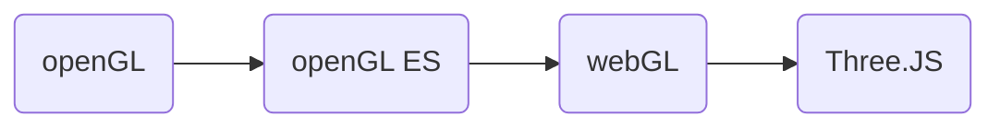

# ThreeCraft

基于<logos-threejs />Three.js的<MdiMinecraft/>MineCraft网页版实现

---

# 研究背景与意义🤔

《我的世界》是<MdiMicrosoft/>微软旗下的沙盒游戏。游戏中，玩家可以在一个3D世界內与方块进行交互。游戏中的特色功能包括**探索世界、采集资源, 合成物品及生存冒险等**.

截至2021年5月，《我的世界》拥有2.38亿销量，1.5亿月活跃用户，成为有史以来最畅销的电子游戏.

- 🤹 **丰富游戏模式** - 生存模式 / 创造模式 / 冒险模式 / 极限模式 / 旁观模式
- 🧑‍🤝‍🧑 **方便联机** - 局域网联机 / 互联网联机(官方/自建服务器)
- 🧩 **高可扩展性** - 提供开放接口, 模组 / 贴图 / 地图等均可从自定义
- 🧑‍💻 **跨平台支持** - <LogosMicrosoftWindows/> Windows / <LogosLinuxTux/> Linux / <LogosMacosx/> macOS / IOS / <MdiMicrosoftXbox/> XBox / <IcOutlineAndroid/> Android / <MdiSonyPlaystation/> PlayStation / <MdiNintendoSwitch/> Switch / **<BiHeadsetVr/> VR**
- 🙌 **社区活跃** - 玩家基数多
- 🗽 **自由高质量** - 无限地图, 光追...

 
 

更多 [背景材料](https://zh.wikipedia.org/wiki/%E6%88%91%E7%9A%84%E4%B8%96%E7%95%8C)

---

# 研究背景与意义🤔

<v-clicks>

- <LogosChrome/> **浏览器绘图能力提升**
  - 96.56% 的浏览器支持[Canvas](https://caniuse.com/?search=canvas)
  - 94.94%的浏览器支持<SimpleIconsWebgl/>[WebGL](https://caniuse.com/?search=webgl) 
  - 87.31%的浏览器支持<SimpleIconsWebgl/>[WebGL 2.0](https://caniuse.com/?search=webgl)
- <LogosWebassembly/> **WebAssembly**技术蓬勃发展
- 🖼️**图形技术的进步减轻了硬件负荷** - <SimpleIconsNvidia/>DLSS / <FileIconsAmd/>FSR / <del><CibIntel/>XeSS</del>
- 💸 **正版太贵了** - CNY ¥ 165

</v-clicks>

---

# 研究内容🔬

- 数据库设计
- 联机服务器实现
- 开放API实现
- 角色系统, 打斗系统
 
...

---
layout: center
---

🧑🏼‍🦲

❌

---

# 研究内容🔬

WebGL实践

<v-clicks>

- 浏览器中3D场景实现(创造模式轻量版)😎
- 无限世界随机动态生成😎
- ...😎

</v-clicks>

---

# 可行性分析🙆‍♂

- 主要功能: 
  - 3D场景
  - 自由漫步, 简单修改场景
  - 支持渲染参数调节
  - (存档...)
- 技术可行性: 
  - 需要学习WebGL与ThreeJS
- 操作可行性
  - 操作简单, 易于使用
- 软件可行性
  - 无需专业软件

---

# 技术路线🗺️

- 
常见游戏制作引擎: <SimpleIconsUnrealengine/>, <MdiUnity/>

- 
常见的H5游戏引擎: <SimpleIconsCocos/>, Phaser

- 
MVVM框架: <LogosVue/>, <LogosReact/>, <LogosAngularIcon/>

---

# 技术路线🗺️

<v-clicks>

- <LogosThreejs/> Three.js (三维图形库)
  

</v-clicks>
<v-clicks>

- <LogosTypescriptIcon/> Type Script (实现语言)
- <LogosVitejs/> Vite (打包工具)
- <CibSocketIo/> Socket.io (WS库)

</v-clicks>

---

# 研究方法与进度计划📅

- <input type="checkbox" name="CG" checked> 2022.04.10 - 2022.04.26 图形学入门
- <input type="checkbox" name="WGL" > 2022.04.27 - 2022.05.04 WebGL入门
- <input type="checkbox" name="TJS" > 2022.05.05 - 2022.05.12 Three.JS入门
- <input type="checkbox" name="release" > 2022.05.12 - 项目实现
  - <input type="checkbox" name="release" > 人物属性
  - <input type="checkbox" name="release" checked> 贴图资源
  - <input type="checkbox" name="release" > 三维贴图与地形生成
  - <input type="checkbox" name="release" > 渲染管线(*)
  - <input type="checkbox" name="release" > 交互实现
  - <input type="checkbox" name="release" > 碰撞检测
  - <input type="checkbox" name="release" > (新建删除方块动画实现)
  - <input type="checkbox" name="release" > (web worker)
  - <input type="checkbox" name="release" > (存档功能)
  - <input type="checkbox" name="release" > (水, 云的实现)

---

# 更多工作🍪

- 😀基于WebSocket的局域网多人游戏
- 😕可视化[<LogosRedditIcon/> r/place](https://www.reddit.com/r/place)
- 🙃光线追踪
- 🙃TAA
